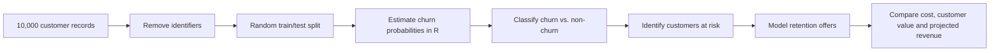

# Customer Churn Prediction & Retention Strategy

**10,000 customers · 21% observed churn · 79% reported classification accuracy · 4 retention scenarios**

> Original IBA Karachi group project (2019) with a clearly labeled 2026 documentation/reproduction layer.

Academic business analytics project completed at **IBA Karachi** for *Analytical Approach to Marketing Decisions*.

**Focus:** churn prediction, customer retention, offer economics, and business decision-making  
**Tools used in the original project:** Microsoft Excel and RStudio  
**Dataset:** 10,000 banking customers from a public Kaggle churn dataset

## Business Problem

The project asked two connected questions:

1. Which customers are most likely to leave?
2. What retention policies could be offered to reduce churn while still making economic sense?

Rather than stopping at prediction, the project linked churn analysis to **retention offers, customer value, offer cost, conversion assumptions, and projected revenue**.

## Key Results

| Metric | Reported result |
| --- | ---: |
| Observed churn rate | 21% |
| Classification accuracy | 79% |
| Recall | 47% |
| Precision | 49% |
| Training records | 4,907 |
| Testing records | 5,093 |
| Retention scenarios evaluated | 4 |

> These are the results reported in the original 2019 group project. They should be interpreted in the context of the assumptions and limitations documented below.

## Retention Scenarios Evaluated

| Scenario | Approx. offer cost | Conversion assumption | Reported revenue | Reported model improvement |
| --- | ---: | ---: | ---: | ---: |
| Discounted rate / service offer | $40–45 per targeted customer | 50% | $988,239.11 | 1.42% |
| Reduce withholding tax by 0.3% | ~$7 per customer | 50% | $1,025,548.46 | 5.25% |
| Reduce fees / service charges | ~$11 per customer | 50% | $1,020,965.54 | 4.78% |
| Share value generated from retained balances | ~$72 per customer | Not clearly preserved in the report | $6,191,794.41 | 4.70% |

The fourth scenario reported a customer lifetime value of roughly **$1,448** under the project's assumptions.

## Analytical Workflow

### Variables Used

The original dataset included:

- Credit score
- Geography
- Gender
- Age
- Tenure
- Balance
- Number of products
- Has credit card
- Active member
- Estimated salary
- Churn / exit outcome

Identifiers such as row number, customer ID, and surname were removed before modeling.

## Business Assumptions Used in the Original Project

The original report incorporated assumptions to estimate retention economics:

- 15% of salary was treated as the customer's deposit contribution.
- Historical deposit-rate information from 2000–2016 was used for France, Germany, and Spain.
- A 50% offer-acceptance rate was assumed for several scenarios.
- Published estimates for customer acquisition vs. retention cost were used for the first scenario.
- Additional assumptions were introduced where the source dataset did not provide operational cost data.

## What This Project Demonstrates

This project is useful to me today because it combines three areas that are often separated:

- **Predictive analytics:** identify likely churners.
- **Customer retention:** design interventions instead of only reporting risk.
- **Business economics:** compare the cost of intervention with expected customer value and revenue.

That makes it directly relevant to customer experience, retention, product operations, and commercially minded analytics work.

## Repository Structure

- `docs/original-project-summary.md` — concise reconstruction of the original report
- `analysis/reproduction.R` — a modern reproduction scaffold based on the documented methodology
- `data/README.md` — dataset notes and instructions
- `.gitignore` — keeps local datasets and R workspace files out of Git

## Important Note About the Code

The original course report survives, but the exact original R source code was not preserved in the files currently available.

For transparency, `analysis/reproduction.R` is a **2026 reconstruction** of the workflow described in the report. It is not presented as the original 2019 code and may not reproduce the exact reported metrics without the exact original split and model specification.

## Limitations

The original report itself identified several limitations:

- The bank name and exact source context were not available.
- The dataset's time period was not clearly stated.
- Data covered three countries, requiring country-specific assumptions.
- Exact internal costs of retention offers were unavailable.
- Several profitability calculations therefore depended on researched or assumed values.

## Future Improvements

A production-quality version would improve the work by:

- using cross-validation rather than one train/test split,
- optimizing the decision threshold for retention economics,
- evaluating ROC-AUC / PR-AUC and calibration,
- measuring lift in high-risk customer segments,
- using expected value to target offers,
- estimating offer acceptance from experiment data,
- and validating retention impact with controlled A/B testing.

## Credits

Original group project members included **Shahzad Raza Arain** and eight classmates.  
Instructor: **Hassaan Khalid**  
Course: **Analytical Approach to Marketing Decisions**

---

This repository documents an academic project and its business reasoning. Reported financial figures are scenario outputs based on academic assumptions, not audited banking results.
